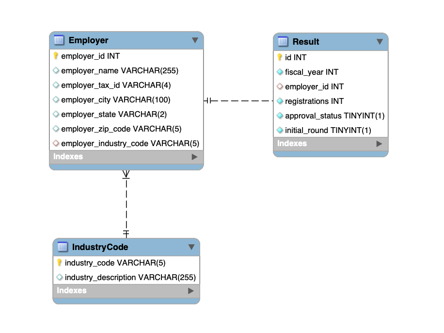

# Non-Immigration Work Visa Lottery Analysis

## Overview
This project analyzes the results of the H1-B visa lottery. The dataset contains information about employers, their registrations, approval status, and other relevant details.

## Table of Contents
- [Installation](#installation)
- [Usage](#usage)
- [Schema](#schema)
- [Queries](#queries)
- [Contributing](#contributing)
- [License](#license)

## Installation
1. Clone the repository: `git clone https://github.com/thienducthinh/Non-Immigration-Work-Visa-Lottery.git`
2. Install Python packages:
    ```bash
    pip install pandas pymysql tabulate
    ```
3. Set up your database in `connectdb.py` with your schema and password.

## Usage
- Load your H1-B lottery result data into the database.
- Use the provided SQL queries to analyze the data and gain insights.
- Modify the queries or create new ones based on your analysis requirements.

## Schema
- The project uses three tables:
    - `IndustryCode`: Contains industry codes and descriptions.
    - `Employer`: Stores information about employers, including their industry code.
    - `Result`: Stores lottery results, including employer IDs, registrations, approval status, etc.



## Queries
- Sample SQL queries are provided in the README for various analysis tasks such as:
    - Finding top industries by number of employers.
    - Calculating total registrations and approvals by industry.
    - Identifying employers with the highest number of registrations in the initial round.

## Contributing
Contributions are welcome! If you find any issues or have suggestions for improvement, please open an issue or submit a pull request.

## License
This project is licensed under the [MIT License](LICENSE).